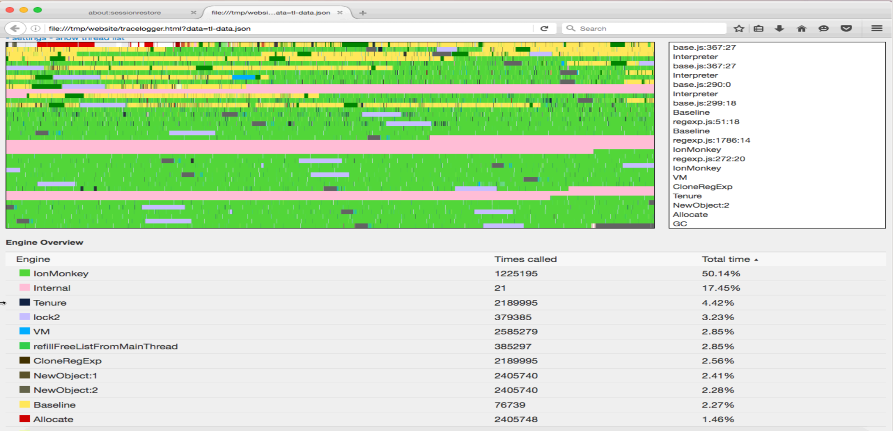

Tracelogger graph
=================

Tracelogger is a tool in the SpiderMonkey JS engine that can make execution traces. This repository contains the tools a graph out of these traces. The tool is mostly used by JS engine engineers to pinpoint issues or to have a broad view of what is going in the engine.

In order to get a trace and corresponding file output, one has to run the JS shell or browser with an environment variable:
TLLOG=Default TLOPTIONS=EnableMainThread,EnableOffThread,EnableGraph

This will create files in /tmp/ on linux and in the current directory on windows. The main file is tl-data.json, which contains a pointer to all extra files. Per thread there will be a "tl-dict.\*.json", "tl-tree.\*.json" and a "tl-event.\*.json" file.

Configuring what needs to be traces can be done by adjusting the TLLOG and TLOPTIONS environment variables. To get a list of every possible input you can put "help" in the environment variable.
- TLLOG: This variable decides what gets traced. Default contains an default list of items to trace, but it is possible to trace other things. There are hooks that are not enabled by default to trace individual compilation passes or VM calls. Note: By enabling more, you will get more overhead and the files will get bigger.
- TLOPTIONS: This variable decideds some global options. The JS engine has the notion of mainthread (that runs the JS code) and helper threads (offthread), which helps in GC, compilation, parsing ... It is possible to only log one or the other. The EnableGraph part is needed to create the graph output files from the traces in memory. Don't omit that.

Tools V2
========

**1. Creating a tracelogging graph:**

- Checkout the tracelogger repo, or download just the content of the "website" folder
- Run "python <path-to-website-dir>/server.py" from the directory containing the trace files (the current directory on Windows or /tmp elsewhere, unless $TLDIR was used)
- Navigate with a browser to "http://localhost:8000/tracelogger.html"

**2. JavaScript tools:**

There are some small javascript tools included that can give another view on the the logged data.
They can get execute with "execute.py". Execute "execute.py -h" to get an full list of those tools.

- dump: Dump the binary format in a textual format.
- dump_flat: Dump the binary format in a flat textual format.
- overview: Gives an overview of where the time was spend.
- waiting_for_ion: Gives how much time was spend trying to execute a script, that we were compiling in ion.

python execute.py [tool] [js shell] [tl-data.json]

**3. reduce.py: Reducing a tracelogging graph:**

When you need to serve the graphs online or when it takes the browser too long to read the files you can reduce the graphs using a python script.

- Download the full "tools_v2" directory
- Run 'python reduce.py /tmp/tl-data.json /somepath/somename'
- This will create /somepath/somename.json and save all files with the prefix somename

Note: using 'pypy' instead of 'python' will sometimes not work. Some pypy versions contain a bug in their JIT. So if the reduced file is empty, you are probably hitting that bug.

**4. navigate.py: Read log files interactive in the console**

When you don't want an high level overview, but want to navigate the raw data of the logfiles. Navigate the files using arrow keys and enter to view the content inside the tree item.

- Make sure you have a JS shell named $JS
- Download the full "tools_v2" directory
- Run 'python navigate.py $JS /tmp/tl-data.json'

**5. rename.py: Renaming the tracelogging files:**

When you want to rename the files and don't want to adjust the names yourself and update the content of /tmp/tl-data.json. This script does this.

- Run python rename.py /tmp/tl-data.json /somepath/somename
- This will move /tmp/tl-data.json to /somepath/somename.json and move all the data files while renaming the files to begin with somename
